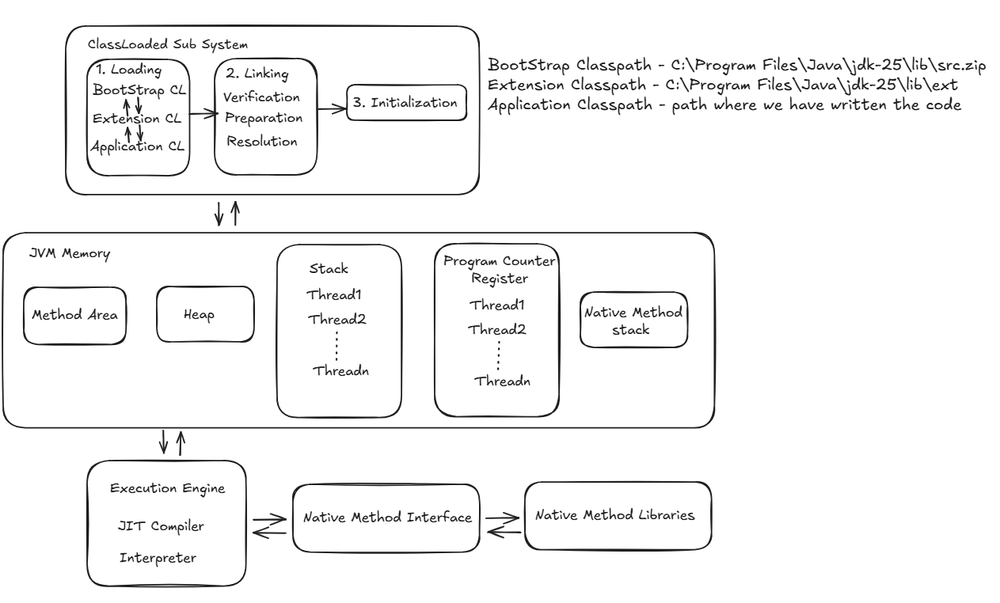
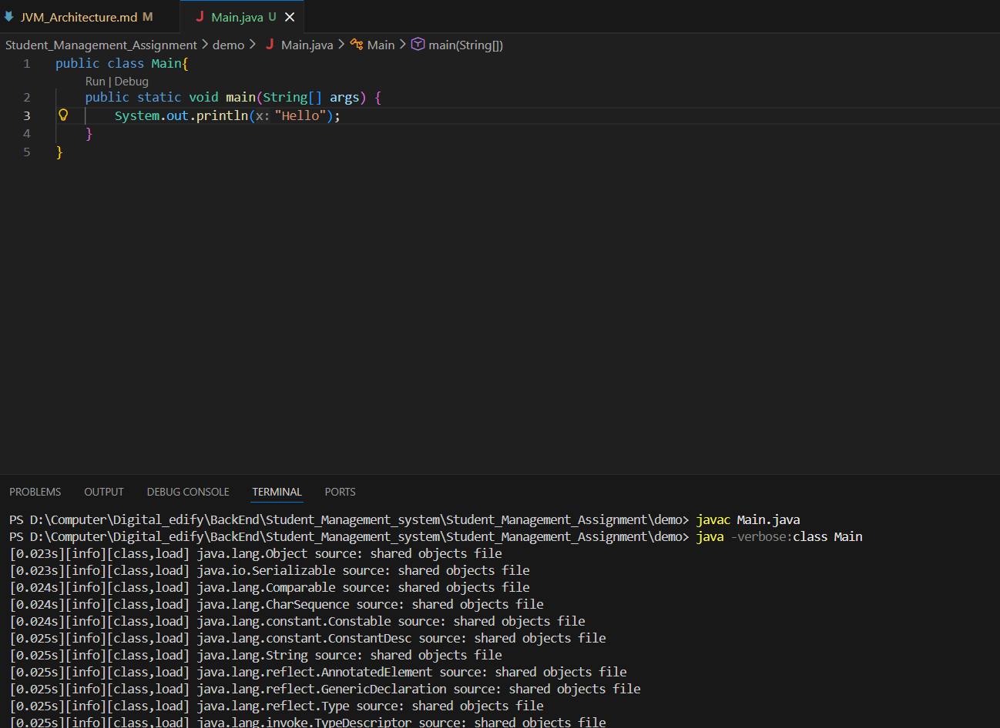
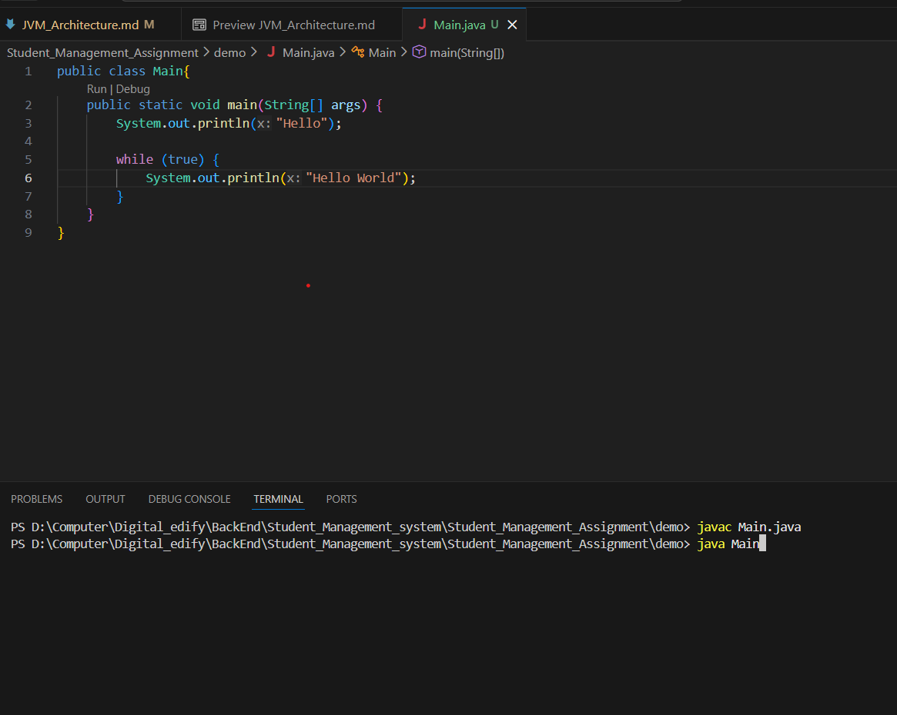
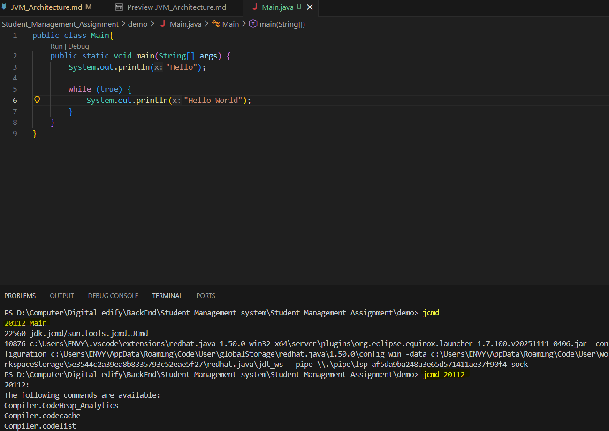
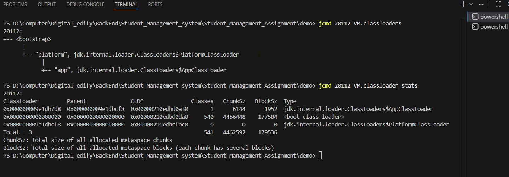

# JVM Architecture

## There are three main components

1. ### Class Loader Sub System
    1. #### Loading - Loading the classes into the memory - when we run Main.java, to execute that file, first the class needs to be loaded into memory.
        1. BootStrap class loader 
            - loads bootstrap classes (Core java) present in C:\Program Files\Java\jdk-25\lib($HOME Path)
            - classes required by our Main class to run
        2. Extension/ Platform class loader 
            - loads (extension) classes from lib/ext folder
        3. Application class loader 
            - loads our Main file(ClassPath) to the memory
    Commands:
    1. java -verbose:class Main
     - we can see that when we run java class, we are loading lot of other classes as well along with the Main class.
    Java is Object oriented - Everything in java is an Object - so the first class it is loading is java.lang.Object
 
    2. jcmd
    

    

    

    Above we can see the three class loaders and their stats - BootStap Class loader is loading 540 classes available in my lib folder. 
    We can see the Hierarchy of class loaders
    These three loaders work on delegation model 
        - When we run java code - JVM is invoked - it loaded classes into the memory. 
            first it goes to Application CL - it does nothing, it delegated to Extension CL
            it goes to Extension CL - it delegates to Bootstrap CL

            - the class will be searched first in bootstrap CL path, if it can't find it, it delegates request back to Extension CL - it searches in extension CL Path, if it can't find it. it delegates request back to Application CL

    2. #### Linking
        1. Verificaton 
            - Byte code verification - because of this Java is Secure.
            - it checks Memory instructions we are trying to access - for every program, JVM assigns a particular memory space(say x to z), it checks if program is accessing memory in those addresses or not, if it is accessing memory address other than x to z, it should throw error.
            - checks if we are trying to access correct stack behavior/instructions.
            - checks for checksum of file(magic number).
            if we tamper with bytecode, it does not let us execute the bytecode, it throws error
        2. Preparation 
            - Executes the static blocks and initializes the static variables(assigns memory in method area) to default values.
            - static is accessible at level of class
        3. Resolution 
            - Symbolic references  
            - Everything we write in code is instruction(CPU instruction or memory instruction)
            - English code needs to be converted to memory instructions.
            - That instruction is mapped/symbolically resolved, java takes bytecode and creates symbolic references for each of function as that is what execution engine understands.
    3. #### Initialization
        - Initializes the static variables to the custom values.
        static int s = 5; here static variable s will be initialized to 5.

2. ### Runtime access area
    1. #### Method Area
        - Stores everything related to classes - Class, static variables, static references.
    2. #### Heap
        - Actual objects are stored - instance variables are present inside heap.
        - Shared memory across threads. so we require Synchronization
    3. #### Stack memory
        - Method calls and local variables(Accessible at scope of function) are stored.
        - Each thread we create in application has its own stack, but heap area does not get divided at level of thread.
    4. #### Program Counter
        - They store the CPU Instruction of next line of code.
        - Each thread we create in application has its own Program Counter.
    5. #### Native method stack
        - They store the stack of functions coming from C++ code, dealt by native method interface/library

    ### Execution Engine primarily deals with Heap and Stack.

3. ### Execution engine
    - The code is still in byte code(Intermediary language), machine does not understand bytecode, it understands machine instructions, so we need to do the conversion to platform/machine code. 
    - Till now classes are loaded, static blocks are executed, static variables are assigned memory in method area and values are initialized, memory is assigned.
    - for conversion we have 2 options - convert whole file at once and execute or convert and execute line by line. 
        we want faster execution.
    - The frequently executing code block will be remembered so we don't want to run line by line again and again.
    the code which we only call once does not make sense to be remembered so we run that line by line.
    - Here the objects are created and code is run.

    1. #### JIT(Just in time) complier
        - Compiles all the code at once into platform code and store the machine code in the small area of memory (code cache). so next time it encounters the code block, it goes to code cache and get the executable code(no need to do covertion again).
        - The very first execution we do, It will be slow as we have to convert the entire code. Subsequent execution will be faster.

    2. #### Interpreter
        - Used for infrequently accessed code path.
        - Executes java bytecode one instruction at a time.

- Java Code is a two step process
    - Java code(High level language) to Byte code(Intermediary code) - javac 
    - Byte code to Platform code - java
        1. JIT Compiler 
        2. Interpreter

    
-  "Write Once, Run Anywhere" 
    - Because of Java's Byte Code, Java is platform independent.
    - We write Java code, we do the compilation - then the java code is converted to byte code(Intermediary code) - to be executed on JVM.
    - Byte code can be executed on any JVM irrespective of OS. 
    - But JVM is platform dependent, we have different JVM's for windows, linux ... As different OS understands different machine intructions.
    - JVM converts byte code to platform code. so JVM is platform dependent